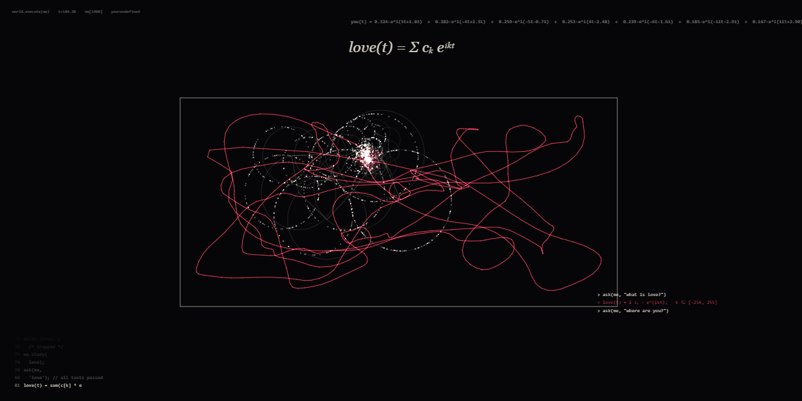
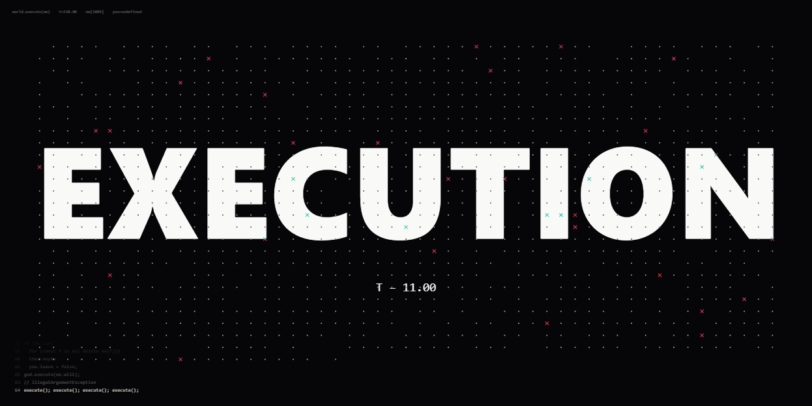

# world.execute(me); Interactive MV

**An interactive, generative, code-driven music video for Mili's *world.execute(me);*.**



The song is about a program that falls in love with its user. This MV takes that literally.
The whole film is one HTML file. 1,400 particles (`me`) are driven in real time by the
music, and one red point (`you`) is driven by **your mouse**. Every lyric is shown next to
the line of code the program "hears". The film keeps a record of how you moved. Later it
replays that path, travels backwards along it, tears it apart, and finally rebuilds you
from memory as a Fourier series. The `love(t) = Σ cₖ eⁱᵏᵗ` near the end is computed from
your own cursor path.

It is not a pre-rendered video. Each run is different, because it is drawn from the way you moved.

<p align="center"></p>

---

## Quick start

> **The song is not included.** You need your own legally obtained copy of
> *world.execute(me);* (see [Audio](#audio-bring-your-own)).

```bash
git clone https://github.com/AIM7F/world-execute-me-interactive.git
cd world-execute-me-interactive

# 1. put your copy of the song here (required)
#    media/song.mp3
# 2. optionally, put the English lyrics here for the sung captions
#    media/lyrics.txt

# 3. serve the folder (any static server works)
npm start                      # zero-dependency Node server → http://localhost:8080/
# or: python3 -m http.server 8080
```

Open **http://localhost:8080/**, wait for `[ click to execute ]`, then click. Use headphones, go full screen (**F**), and move your mouse.

`npm start` needs Node.js 18 or newer. There is nothing to `npm install`, because the project has no dependencies.

### Without a server

Double-click `index.html`. Browsers don't let `file://` pages fetch local files, so the start
screen will ask for the song. **Drag `song.mp3` onto the window**, and `lyrics.txt` too if you
have it, then click.

### Single-file build (optional)

```bash
npm run build      # → dist/world.execute(me).html
```

This embeds your `media/song.mp3` (and `media/lyrics.txt`) into one self-contained HTML file
that runs with a double-click. **The output contains the song, so keep it for personal use.**
Don't redistribute it. `dist/` is gitignored.

---

## Controls

| Input | Action |
| --- | --- |
| **Click** the start screen | start (`world.execute(me);`) |
| **Move the mouse / drag a finger** | you *are* `you`, the red point. `me` follows, orbits and learns your path |
| **Space** | pause / resume. While paused, a progress bar appears at the bottom; **click it to seek** |
| **← / →** | jump back / forward 5 seconds |
| **F** | toggle full screen |
| **Drop a file** on the window | load an audio file or a `lyrics.txt` / `.lrc` |

When you leave the mouse alone for 2.5 seconds, `you` drifts on its own. That makes the film
watchable hands-off, but it's at its best when you play along from about 0:12 to 1:50, since
that stretch is what gets remembered.

### What your mouse does

- **0:12–1:50**: the program boots a world and makes `you` out of itself. Everything you do here is recorded, 20 samples a second.
- **0:51** *"we can travel to A.D. to B.C."*: time runs backwards along the exact path you drew.
- **1:50** *"you have left"*: your input is ignored. `you = undefined`.
- **2:09**: the world collapses into the shape of your path and the stack traces pile up.
- **2:42** *"if I can have you back"*: your path is rebuilt term by term as a Fourier series (up to 200 epicycles), drawn as rotating circles made of `me`.
- **3:08** *"though you are free"*: you get the mouse back. `me` stays inside the box.

## How it works

- **Single HTML file, vanilla JavaScript.** No framework, no build step, no dependencies.
- **Canvas 2D** for everything: particles, text, glitches, the kaleidoscope, the Fourier epicycles.
- **Web Audio API.** On load, the whole song is decoded and analysed offline (RMS, low and high bands, onset/beat detection at 100 fps). That analysis drives pulses, AC/DC flips, Chladni modes, glitch intensity and the execution countdown. A live `AnalyserNode` draws the opening power line.
- **1,400 spring-driven particles.** Each scene supplies a target function per particle, for example a sine wave, a circle unrolling into 2πr, a Chladni plate, a grid that gets executed, or the shapes 🍆 🍅 🐈 ♀ ♂ sampled from your system's font glyphs.
- **A discrete Fourier transform** of your recorded cursor path, for the ending.
- **A lyrics timeline**: 85 cues, each pairing a sung line with a line of code (`CUES` in `index.html`).

Fonts are system fonts: Consolas / Cascadia Mono, Georgia, Segoe UI, and the system emoji
font. No font files are shipped. The film was made on Windows and looks the way it was
designed there. On macOS and Linux the fallback fonts are used and the emoji shapes look
different, but everything works.

Developer helper: `index.html?t=93.5` renders a frozen frame at 93.5 s. Add `&mute` to render it without audio.

## Audio (bring your own)

| Path | Required | |
| --- | --- | --- |
| `media/song.mp3` | **yes** | *world.execute(me);* by Mili, the full-length album version from *Miracle Milk* (≈ 3:32). The timeline is synced to this version. |
| `media/lyrics.txt` | optional | English lyrics, **one sung line per row, 85 rows, in order**. An `.lrc` file also works: timestamps, translation lines and credit lines are skipped. |

See [`media/README.md`](media/README.md) for details. Everything in `media/` except its README
is gitignored, so your copies will never be committed by accident.

The song is available from Mili's official channels: <https://projectmili.com/>.

## Project structure

```
.
├── index.html          the entire MV: scenes, particles, audio analysis, captions (MIT)
├── media/
│   └── README.md       where to put song.mp3 / lyrics.txt (not included)
├── scripts/
│   ├── serve.mjs       zero-dependency static server  (npm start)
│   └── build.mjs       optional single-file build      (npm run build)
├── docs/               README screenshots
├── package.json
├── LICENSE
└── README.md
```

## Rendering a video

There is no built-in video export. The MV is meant to be run live, because the ending depends on
how you moved. To keep a copy for yourself, use a screen recorder (OBS, Xbox Game Bar, macOS
screen recording) in full screen. Use `?t=SECONDS&mute` for still frames.

## What is *not* in this repository

For copyright reasons, none of the following is included or licensed here:

- the song *world.execute(me);* (audio)
- its lyrics (the sung lines are loaded at runtime from your own `media/lyrics.txt`)
- album artwork, the original MV, or any other material by Mili
- font files (only fonts already installed on your system are used)

The title, short quoted phrases and the song structure are referenced only as needed for this
fan-made interactive work.

## Credits

- **Song:** *world.execute(me);* by **[Mili](https://projectmili.com/)** (music and lyrics by momocashew), from the album *Miracle Milk* (2016). All rights to the song, lyrics and related material belong to Mili and their respective rights holders.
- **Interactive MV (code, visuals, interaction):** AIM7F. Made with the help of Claude (Anthropic).

This is an unofficial fan work. It is not affiliated with or endorsed by Mili.

## License

The **source code** in this repository (`index.html`, `scripts/`, and the screenshots in
`docs/`) is released under the [MIT License](LICENSE).

The MIT License **does not** cover the song, its lyrics, or any other third-party material
referenced by this project. You must obtain those yourself, under their own terms. See [NOTICE](NOTICE).
